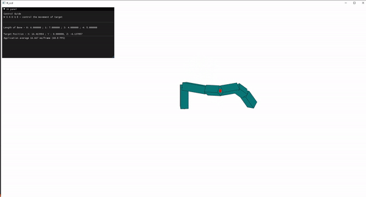
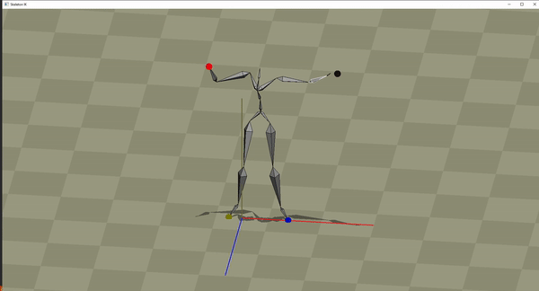
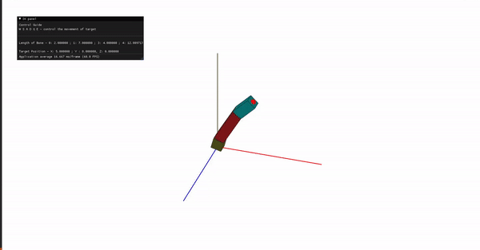

# IK_example (CCD Jacobian FABRIK)

Practice for some popular IK implemntaion in OpenGL 2.0 

My personal feeling of speed&performance for different IK methods

<pre>
<b>Fast</b> ←------------------------→ <b>Performance</b> 
CCD            FABRIK           Jacobian

My favorite one would be the FABRIK one 👍
</pre>

- [Top](#ik_example-ccd-jacobian-fabrik)
  - [Installation](#installation-guide-for-windows-user-visual-studio)
  - [How to control](#control)
  - [TODO](#todo)
- [CCD IK](#ccd-ik-0_ikccd)
- [Skeleton IK](#skeleton-ik-1_skeleton_ik)
- [Jacobian IK](#jacobian-transpose-2_ik_jacobian)
- [FABRIK](#fabrik-3_fabrik)

## Installation guide for Windows user (Visual Studio)
1. `git submodule update --init`.
2. download glfw [pre-compiled library](https://www.glfw.org/download) and put the uncompressed files under `3rd_party/libglfw`.
3. run `cmake -S . -B build` under `/0_ikccd` or `/1_skeleton_ik` or `/2_ik_jacobian` or `/3_FABRIK` folder.
4. `/***/build/***.sln` will be the Visual Studio solution files, open it and build in **Release** mode.

## Control
1. Using **W S A D** control the horizontal movement of the target 
2. Using **E Q** control the vertical movement of the target
3. Using **1 2 3 4** switch between four different target IK
4. Using **ALT + Hold Left Click** control the camera
5. Using **Scroll up/down** control the camera zoom in/out

## TODO
- [x] CCD
    - [x] Basic
    - [x] Hinges
    - [x] Limits
- [x] FABRIK
- [x] Jacobian
    - [x] Jacobian Transpose
    - [ ] Jacobian Inverse

# CCD IK (0_ikccd)
CCD IK implementation using a custom 3D struct built by myself 

# Skeleton IK (1_skeleton_ik)
Applying the CCD IK on rig bones 

# Jacobian Transpose (2_ik_jacobian)

# FABRIK (3_FABRIK)

*Practice for some popular IK implemntaion in OpenGL 2.0 Copyright Yifei Chen*
