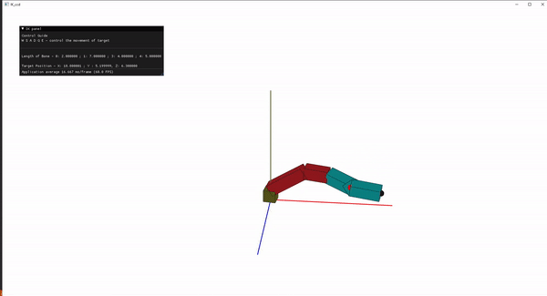

# IK_example

Practice for some popular IK implemntaion in OpenGL 2.0 

## Installation guide for Windows user (Visual Studio)
1. `git submodule update --init`
2. download glfw [pre-compiled library](https://www.glfw.org/download) and put the uncompressed files under `3rd_party/libglfw`
3. run `cmake -S . -B build` under `/0_ikccd` folder
4. `/0_ikccd/build` will contain the Visual Studio solution files

## TODO
- [x] CCD
- [ ] FABRIK
- [ ] Jacobian Transpose

